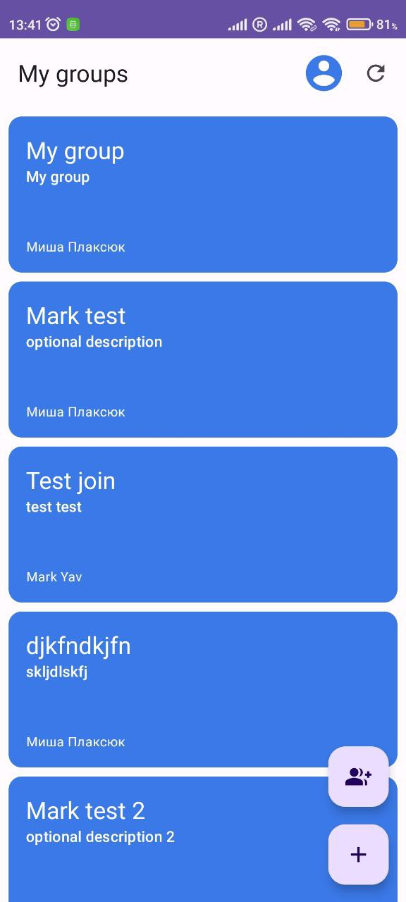
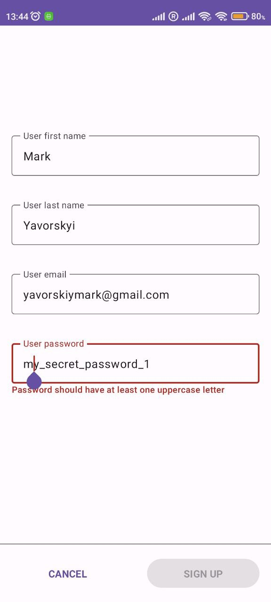
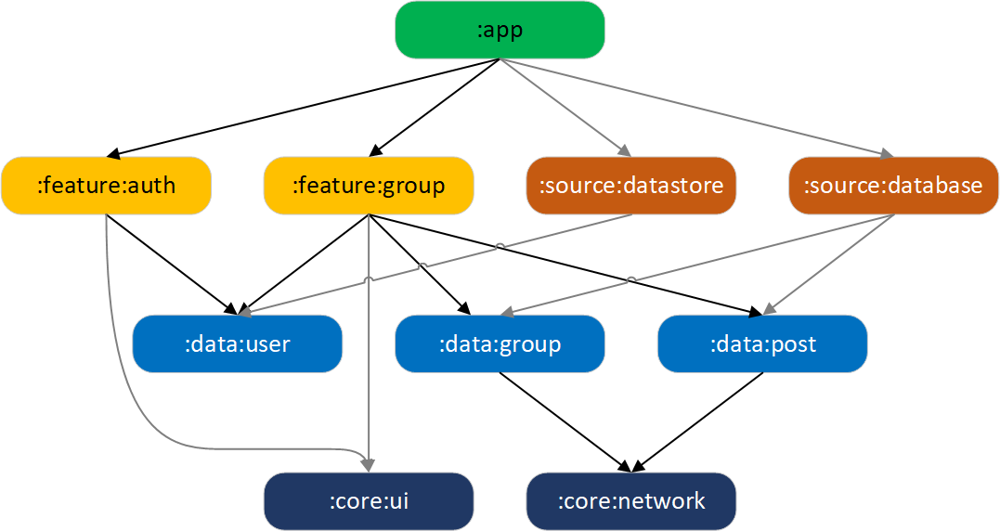
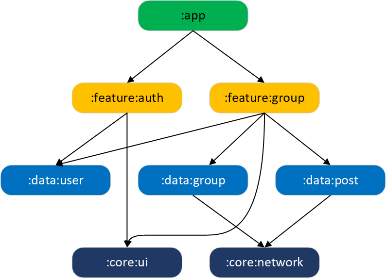
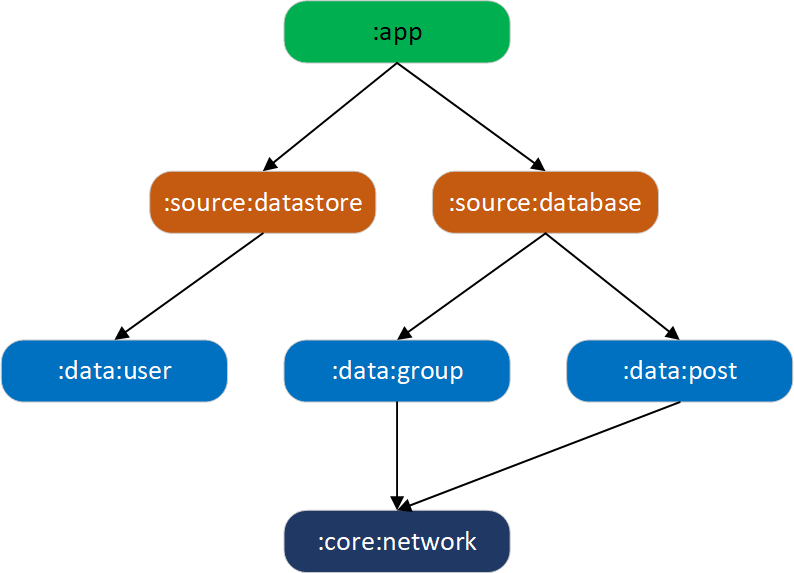

CubIT Android App [Work in progress 🚧]
==================

This is an Android-part of the team project.

**CubIT Android App** is a fully functional Android app built entirely with Kotlin and Jetpack Compose. 
It follows Android design and development best practices.

The app is currently in early stage development and is not yet available on the Play Store.

# Screenshots

 
 

# Architecture

The **CubIT Android** app follows the
[official architecture guidance](https://developer.android.com/topic/architecture).

# Modularization

The **CubIT Android** app has been fully modularized.

 

There is the main modules dependency graph below:

 

We encapsulate all data-logic specific to each domain in data-modules.
But there is troubles when we want to have a database that have relations between domains.
For this purpose we have only DAO-interfaces in data-layers and its realization will be in one separate module - :source:database.
Also, I moved the datastore to the separate module too. This will help us if we want to rewrite this project in KMM.

